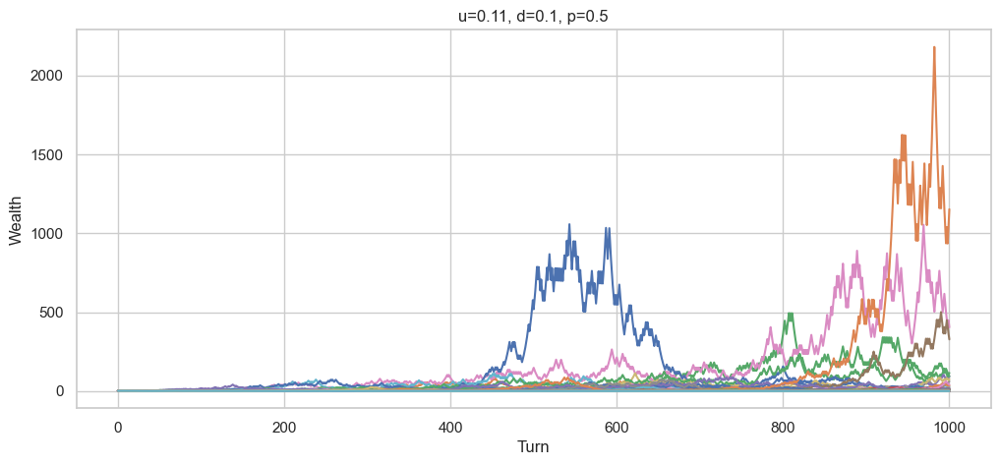

# KellyCriterion

This small notebook presents the intuition behind the Kelly criterion and why it arises.

More broadly, it aims to bring intuitiveness to a notoriously counter-intuitive result, not to say paradox.

